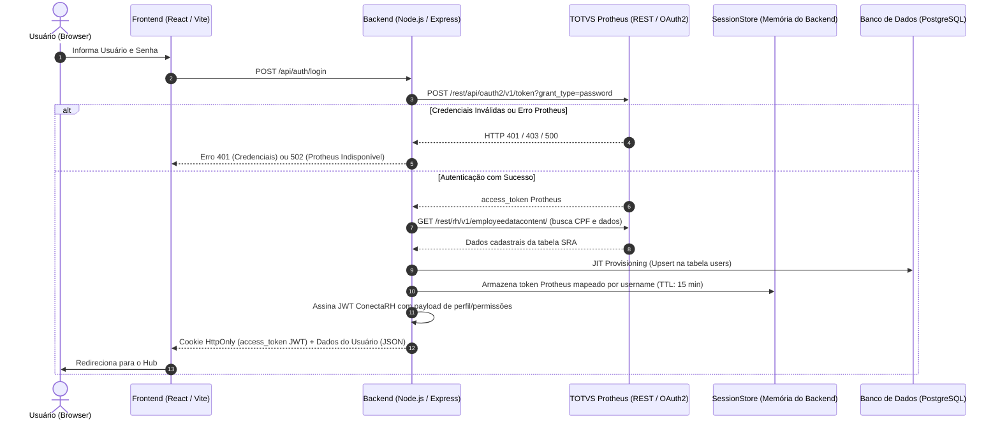

# Documentação de Integração: TOTVS Protheus & ConectaRH

Esta documentação descreve a arquitetura, o fluxo de autenticação e os padrões de chamada de API para integração entre o sistema **ConectaRH** e o **TOTVS Protheus**.

---

## 1. Visão Geral da Arquitetura

O sistema adota um modelo híbrido e seguro:
- **Protheus como Provedor de Identidade (IdP)**: As credenciais (`username` e `password`) de usuários corporativos são validadas diretamente no Protheus via OAuth2.
- **Sessão Local via JWT & Cookie HttpOnly**: O ConectaRH gerencia a sessão web através de seu próprio JWT assinado, mantendo dados de acesso e permissões (RBAC / Multi-empresa).
- **SessionStore em Memória**: O token de acesso do Protheus nunca é exposto ao cliente web (browser); ele fica retido com segurança no backend durante o tempo de vida da sessão (15 minutos).



---

## 2. Fluxo de Autenticação (Login)

### 2.1. Requisição de Login
O formulário de login no Frontend dispara uma requisição HTTP para o endpoint de autenticação do ConectaRH:

- **Endpoint**: `POST /api/auth/login`
- **Origem no Frontend**: `frontend/src/pages/rh/Login.jsx` via `frontend/src/services/api.js` (`withCredentials: true`).
- **Payload**:
```json
{
  "username": "usuario.conasa",
  "password": "senhaDoUsuario"
}
```

### 2.2. Execução no Backend (`backend/src/controllers/authController.js`)
1. **OAuth2 no Protheus**: O backend invoca `getProtheusTokenDynamic(username, password)` que envia uma requisição `POST` para a rota de token do TOTVS Protheus com `application/x-www-form-urlencoded`.
2. **Tratamento de Falha**:
   - Status `401` ou `403` do Protheus: Retorna `401 Unauthorized` ("Usuário ou senha incorretos.").
   - Indisponibilidade de rede ou falha no serviço TOTVS: Retorna `502 Bad Gateway` ("O Protheus está indisponível no momento...").
3. **Auto-cadastro (JIT Provisioning)**:
   - Com o token do Protheus obtido, o backend realiza uma consulta na API de funcionários (`protheusService.buscarFuncionarios`) para capturar o CPF do usuário.
   - Executa um `upsert` na tabela `users` do PostgreSQL via Prisma. Se o usuário ainda não existia no banco local, ele é criado com o papel padrão `USER`.
   - Se o usuário estiver marcado como inativo no ConectaRH (`user.active === false`), a autenticação é abortada com `403 Forbidden`.
4. **Armazenamento Seguro do Token Protheus (`SessionStore`)**:
   - O `access_token` retornado pelo Protheus é salvo no `backend/src/lib/sessionStore.js` associado ao `username`.
   - Possui expiração automática em memória (**TTL de 15 minutos**).
   - O frontend **nunca** tem acesso ao token bruto do Protheus.
5. **Geração do JWT da Aplicação**:
   - O ConectaRH gera um token JWT assinado (`JWT_SECRET`) contendo: `username`, `name`, `role`, `empresaId`, `empresaIds`, `filialId` e `departamentCode`.
   - O JWT é gravado em um cookie seguro `access_token` (`httpOnly: true`, `secure: true`, `sameSite: 'lax'`, `maxAge: 15min`).
   - Os dados do perfil do usuário são retornados no corpo da resposta JSON para o estado da aplicação.

---

## 3. Tipos de Chamadas e Tokens para a API do Protheus

O sistema implementa **três estratégias** de chamadas ao Protheus:

| Tipo | Origem do Token | Onde é Utilizado | Finalidade |
| :--- | :--- | :--- | :--- |
| **Token Dinâmico do Usuário** | `SessionStore` (memória) | Rotas autenticadas (`/api/funcionarios`, autocomplete em desligamento) | Realizar consultas no Protheus utilizando as permissões e o contexto do usuário logado. |
| **Token de Sistema Fixo** | `.env` (`PROTHEUS_SYSTEM_USER`) | Rotas públicas (ex: checagem de CPF no formulário DISC) | Consultar dados de colaboradores na tabela SRA quando não há usuário logado. |
| **Token de Integração DISC** | `.env` (`PROTHEUS_DISC_USER`) | Sincronização DISC (`backend/src/services/discProtheusService.js`) | Enviar pontuações e fatores do teste comportamental DISC para a tabela customizada `ZRH`. |

---

## 4. Endpoints e Integrações Detalhadas

### 4.1. Autenticação OAuth2 (TOTVS Token Service)
- **URL**: `https://restauth.protheus.conasa.com/rest/api/oauth2/v1/token?grant_type=password`
- **Método**: `POST`
- **Headers**: `Content-Type: application/x-www-form-urlencoded`
- **Body**: `username=<usuario>&password=<senha>`
- **Arquivo**: `backend/src/services/protheusService.js` (`getProtheusTokenDynamic` / `getSystemToken`)

---

### 4.2. Consulta de Funcionários / Tabela SRA (`employeedatacontent`)
- **URL**: `https://restauth.protheus.conasa.com/rest/rh/v1/employeedatacontent/`
- **Método**: `GET`
- **Arquivo**: `backend/src/services/protheusService.js` (`buscarFuncionarios`, `buscarFuncionarioPorCpf`, `buscarFuncionarioPorCpfSistema`)
- **Headers**:
  - `Authorization`: `Bearer <protheus_token>`
  - `tenantId`: `<empresaId>,<filialId>` *(Exemplo: `07,01`)*
- **Query Parameters**:
  - `product`: `'PROTHEUS'`
  - `companyId`: Código da empresa *(Ex: `'07'`)*
  - `branchId`: Código da filial *(Ex: `'01'`)*
  - `fields`: `'companyKey,branch,code,name,id,cpf,RA_CIC,departamentCode,departmentDescription,costCenterCode,costCenterDescription,demissionDate'`
  - `filter`: Expressão AdvPL/SQL:
    - Busca por nome: `UPPER(RA_NOME) LIKE 'NOME%'`
    - Busca por CPF: `RA_CIC = '12345678900'`
  - `pageSize`: Limite de registros retornados (padrão: `20`)

---

### 4.3. Integração Comportamental DISC (Tabela ZRH)
- **URL**: `${PROTHEUS_DISC_BASE_URL}/conectarh/disc`
- **Métodos**: `POST` (Insert) com fallback para `PUT` (Update)
- **Arquivo**: `backend/src/services/discProtheusService.js` (`enviarDiscParaProtheus`)
- **Headers**:
  - `Authorization`: `Bearer <token_disc>`
  - `tenantId`: `<companyId>,<branchId>`
  - `Content-Type`: `application/json; charset=utf-8`
- **Regra de Envio e Fallback 409 (Conflict)**:
  1. O sistema tenta primeiro uma requisição `POST` para inserir um novo registro na tabela `ZRH`.
  2. Se o Protheus retornar `409 Conflict` (ou `errorType: "CONFLICT"`), significa que o CPF já possui histórico cadastrado.
  3. O serviço intercepta o erro e automaticamente executa uma requisição `PUT` para atualizar os dados existentes.
  4. O envio é assíncrono (não trava o encerramento do teste pelo candidato) e conta com funcionalidade de reenvio manual para o RH.
- **Cache de Token**: As credenciais do DISC são cacheadas em memória (`_tokenCache`) com margem de segurança de 30 segundos antes da expiração. Se o Protheus responder `401 Unauthorized`, o cache é invalidado imediatamente.

---

## 5. Middlewares e Propagação de Sessão

No backend, o arquivo `backend/src/middlewares/authMiddleware.js` expõe dois middlewares principais:

1. **`authMiddleware` (Autenticação Completa com Sessão Protheus)**:
   - Extrai e valida o JWT do cookie `access_token`.
   - Popula `req.user` com dados do usuário, papéis (`role`) e lista de empresas (`empresaIds`).
   - Recupera o token do Protheus em `sessionStore.get(req.user.username)`.
   - Injeta o token em `req.protheusToken`. Se a sessão no Protheus tiver expirado no backend, retorna `401` exigindo novo login.
2. **`verifyToken` (Validação Apenas de JWT Local)**:
   - Valida apenas o JWT do ConectaRH para rotas que não interagem com o Protheus (ex: gerenciamento de acessos internos, links, aprovações).

---

## 6. Mapeamento de Arquivos do Projeto

| Arquivo | Responsabilidade |
| :--- | :--- |
| `backend/src/services/protheusService.js` | Métodos principais de chamada ao Protheus: obtenção de token OAuth2, busca por nome e CPF na tabela SRA. |
| `backend/src/services/discProtheusService.js` | Serviço de integração da avaliação DISC com o endpoint `/conectarh/disc` (POST/PUT, cache de token). |
| `backend/src/controllers/authController.js` | Autenticação no Protheus, JIT Provisioning, gravação no SessionStore e emissão do JWT. |
| `backend/src/lib/sessionStore.js` | Armazenamento seguro em memória dos tokens Protheus por usuário com TTL de 15 minutos. |
| `backend/src/middlewares/authMiddleware.js` | Middleware de validação de JWT e injeção do `req.protheusToken`. |
| `backend/src/controllers/desligamentoController.js` | Consumo de `req.protheusToken` para autocomplete de colaboradores de desligamento. |
| `backend/src/controllers/employeeController.js` | Verificação pública de colaboradores via `buscarFuncionarioPorCpfSistema`. |
| `frontend/src/pages/rh/Login.jsx` | Interface de login, controle de mensagens de erro e redirecionamento. |
| `frontend/src/services/api.js` | Instância do Axios com interceptor de renovação/expiração de sessão e suporte a cookies HttpOnly. |
